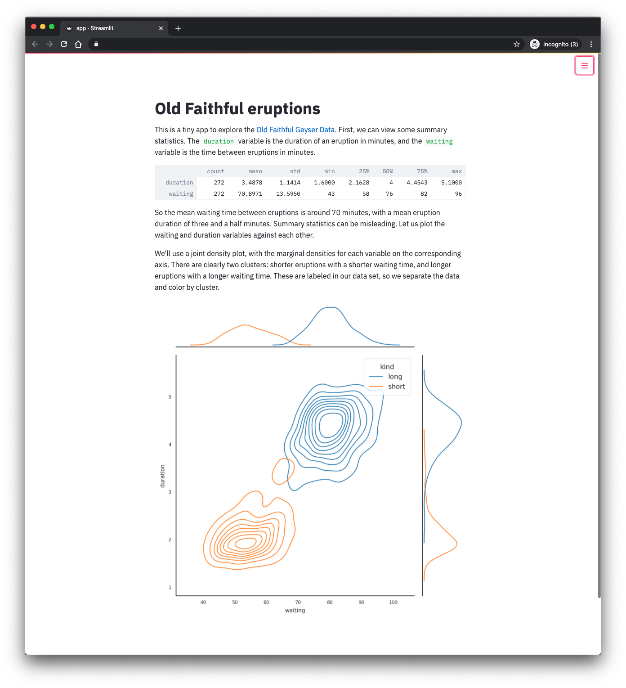

# Streamlit as a CML Application


A minimal example of a [Streamlit](https://www.streamlit.io/) application running as a CML or CDSW Application.
We display and chart a small dataset with Seaborn.

## Repository Structure
#TODO:Change Tree
```bash
.
├── cml                     # This folder contains scripts that facilitate the project launch on CML.
├── docs/images             # Storage for the images in this README.
├── .project-metadata.yaml  # Declarative specification of this project
├── app.py                  # The Streamlit app script.
├── LICENSE                 # This code has an Apache 2.0 License
├── README.md               # This file!
└── requirements.txt        # Python 3 package requirements.
```

## Launching the project on CML

**Manual Setup** - In a CML workspace, click "New Project", add a Project Name, select "Git" as the Initial Setup option, copy in the repo URL, click "Create Project". Launch a Python 3 Workbench Session and run `!pip3 install -r requirements.txt` to install requirements. Then create a CML Application as described in the [CML documentation](https://docs.cloudera.com/machine-learning/1.1/applications/topics/ml-applications.html), using `cml/launch_app.py` as the script.

## Using the app

Once the CML Application has been created (by any means), you can launch it from the Applications pane.
This should open a browser window, with a Streamlit application running at a URL
similar to `streamlit.cdsw-or-cml.your-organisation.com`.

If everything worked, you should see an application like this:

#

To develop the Streamlit app, open a Python 3 workbench session and modify `app.py`.
